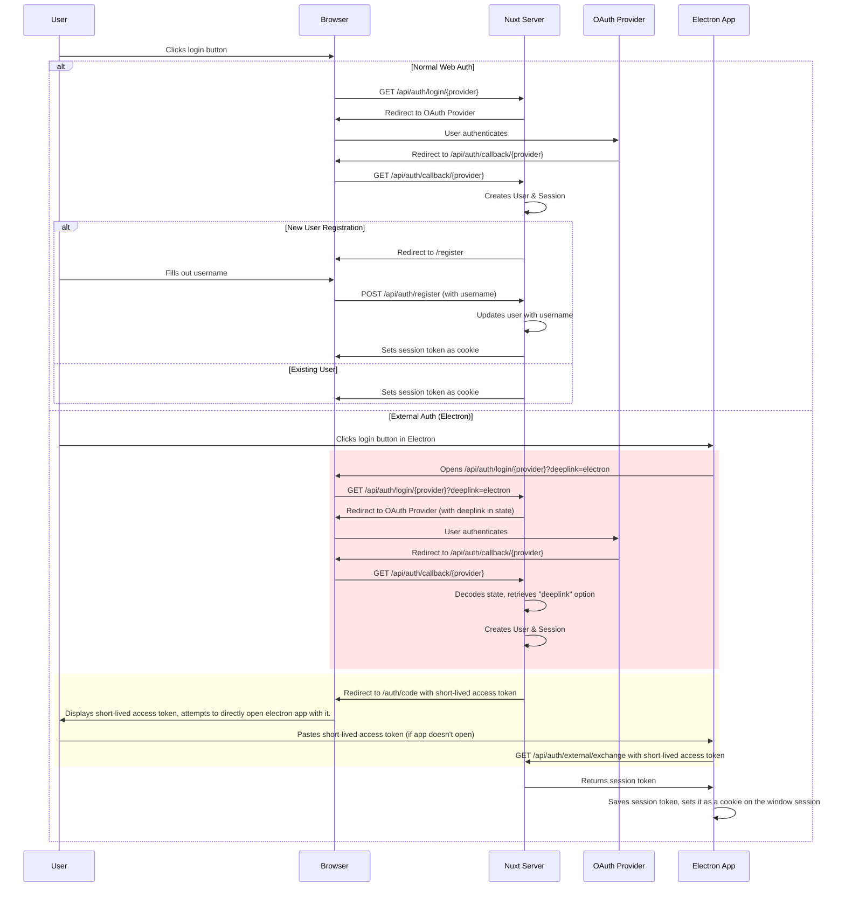

# @witchcraft/nuxt-auth

[![npm version][npm-version-src]][npm-version-href]
[![npm downloads][npm-downloads-src]][npm-downloads-href]
[![License][license-src]][license-href]
[![Nuxt][nuxt-src]][nuxt-href]


VERY WIP wrapper module following the guide by [lucia auth](https://lucia-auth.com/) with postgres and drizzle db.

I am not an auth expert, **use at your own risk**. The module's auth code is not that long, read 
[src/runtime/server/utils/SessionManager.ts](https://github.com/witchcraftjs/nuxt-auth/blob/master/src/runtime/server/utils/SessionManager.ts) (based on lucia) and
[`src/runtime/server/utils/Auth.ts`](https://github.com/witchcraftjs/nuxt-auth/blob/master/src/runtime/server/utils/Auth.ts) which contains all the logic.


## Playground

There is a playground but it must be run locally as it requires a postgres instance and env secrets to be set.

## Features

The following providers are included (using the `arctic` library), custom providers can be easily added.

- [Google](https://console.cloud.google.com/apis/credentials)
- [Github](https://github.com/settings/applications/new)
<!-- - [Facebook](https://developers.facebook.com/apps) -->
<!-- - [Twitter](https://developer.twitter.com/en/portal/dashboard) -->


## Install

It is highly recommended you install the nuxt-security module (or something similar) as this module does NOT add middleware to guard against CSRF.

```bash
pnpx nuxi module add nuxt-security
```

The module requires the `@witchcraft/ui` module for ui components but those are optional so it's not needed if you won't be using them.

```bash
pnpx nuxi module add @witchcraft/ui
```

`@witchcraft/nuxt-logger` is also recommended as it includes redaction for the redact property, otherwise **you will have to implement this yourself**.
All logs are objects with at least an `ns` (namespace) property and can ocassionally contain a `redact` property that **must be redacted in production to be secure**.

```bash
pnpx nuxi module add @witchcraft/nuxt-logger

```
Don't forget to actually pass it's `useServerLogger` when creating the apis.

## Usage

### Secrets

The following env variables are needed:

- `AUTH_SECRET` // for nuxt-auth
- `AUTH_{PROVIDER}_CLIENT_ID`
- `AUTH_{PROVIDER}_CLIENT_SECRET`

Set the ones you need in the nuxt config. There is a helper function for doing this:

```ts
import { genAuthSecretKeys } from "@witchcraft/nuxt-auth/build/genAuthSecretKeys"
// nuxt.config.ts
export default defineNuxtConfig({
	runtimeConfig: {
		...genAuthSecretKeys(["google", "github"]),
		// or manually
		authGoogleClientSecret: "",
		authGoogleClientId: "",
		public: {
			// this is set automatically (for production, it's always true, for dev it's true if nuxt.options.devServer.https is defined)
			// this determines whether to use https in the auth callback url
			// isSecure: ...
		}
	},
	auth: {
		allowedOrigins: [
			...(process.env.NODE_ENV === "development" ? ["http://localhost:3000"] : []),
			"https://your-app-site.com",
			],
		// see also allowedMiddlewareExclusions for external hosts 
		// that should only be allowed access for certain requests
	}
})
```

The callback url is `{http/https}://localhost:3000/api/auth/callback/{PROVIDER}`.
Note that if using `https`, both the allowed origins and the callback url must have https in the provider's config. 

### Basic Setup

#### DB

The module provides a `createAuthSchema` helper and a list of `authUserFields` it needs on the user's table. Unlike some examples, a uuid is used for the id. You can set them up like:

```ts
// path/to/schema.ts
// careful not to use nuxt paths, or drizzle won't be able to import them when when generating migrations, etc
import { authUserFields, createAuthSchema } from "@witchcraft/nuxt-auth/server/utils/createAuthSchema"
export const users = pgTable("users", {
	id: uuid("id").primaryKey().unique()
		.notNull()
	// ... rest of your table
	...authUserFields
})

export const {
	authAccounts,
	authSessions,
	authProvidersRelations,
	authSessionRelations
} = createAuthSchema(users)
```

#### SessionManager and Routes


First configure your session manager instance with your db in some file (it can be anywhere) and export it.

Then create two files:
```
- server
	- middleware
		- auth.ts
	- api
		- auth
		// this is named like this literally, it is a catch-all route
		- [...].get.ts
```

This creates the api handler.
```ts [server/api/auth/[...].ts]

import { createAuthHandler, useServerLogger } from "#imports"
import { authAccounts, users } from "~~/db/schema.js"
import { db } from "[PATH TO YOUR DRIZZLE DB]"
import { sessionManager } from "[PATH TO YOUR SESSION MANAGER INSTANCE]"

export default createAuthHandler(
	useRuntimeConfig(),
	db,
	users,
	authAccounts,
	sessionManager,
	useServerLogger(),
	{
		onRegister: (event, route, deeplink) => {
			// handle user registration, deeplink is for when using external auth handlers (see below)
		}
	}
)
```

This creates the middleware that sets the user/session on the request context.

**IMPORTANT: The middleware by itself DOES NOT validate the origin and does not have any CSRF protection. The nuxt-security is installed by the module to handle this. DO NOT disable it.**

```ts
// server/middleware/auth.ts

import { createAuthMiddleware, useServerLogger } from "#imports"

import { sessionManager } from "[PATH TO YOUR SESSION MANAGER INSTANCE]"
export default createAuthMiddleware(
	sessionManager,
	useServerLogger()
)
```

### Create the Pages

See the playground for a full example, but you will need to create the following pages, components are provided to help create these:

- `/login`
- `/register`
- `/code` (optional, only if using external auth handlers)

### Customizing Login Handling

By default the module will redirect to corresponding api route when calling `useAuth().login/logout()`.

In some cases you may want to customize this behavior, such as when calling this from a desktop app where you need to open a browser instance.

This can be customized with the `handleActions` option on the `useAuth` composable.

There is also a `createExternalAuthHandler` helper and related utils, see [External Auth Handlers](#external-auth-handlers).

### Changing Routes

While not recommended, you can change the routes used by the module by setting the `authApiRoutes` and `authRoutes` options. In the case of the api routes, you will probably want to access them using the getAuthApiRoute helper:

```ts
getAuthApiRoute(useRuntimeConfig().public, "usersInfo")
getAuthApiRoute(useRuntimeConfig().public, "usersIdAccounts", id)
```

#### Middleware

### Auth Middleware

A global middleware is registered by default to determine the user's logged in state (by fetching `/api/auth/users/info`).

This is only done on page load or before (because they might redirect) any actions (login/logout/register\*) so that we don't fetch from the server on every page navigation.

You can use `useAuth().setFetchUserOnNavigation(...)` to allow fetch on the next navigation. The middleware then disables fetching again to prevent further fetching.

The useState keys used to make this work are `auth:_fetch` and `auth:user` if you want to inspect them in the dev tools.

You can also fetch from the api manually if you want and set `auth:user` yourself or do it some other way.

\* The AuthUserRegistration component automatically does this, if you don't use it, you'll need to do it after a succesful registration, but before navigating away. 

### Route Protection

The module does not register a global middleware for route protection by default (see `useGlobalMiddleware`). It must be set:

```ts
definePageMeta({ middleware: "authProtected" })

This will automatically redirect unauthenticated users to the login page and unregistered users to the register page.

Additionally you can set the following meta properties to control the middleware:

```ts
definePageMeta({
	middleware: "authProtected",
	auth: {
		// only allow users on the page that match the given condition.
	 	only: "authenticated" /* | "registered" | "authenticated-unregistered" | "unauthenticated" */

		// change the redirect path
		// or can use the special values "$login", "$register", "$postRegisteredLogin"
		redirectTo: "/some/path", 
	}
})
```
You can register additional paths with the `additionalMiddlewarePaths` option.

### Clearing User Data on Logout 

You can add a `beforeLogout` listener to clear the user data on logout by using `useAuth().on/off`. All added listeners are awaited before actually logging out.

```ts
useAuth().on("beforeLogout", clearUserData)
```
### Branding

The module does not create any pages by default.

Only components like `AuthLoginProviderButtons` are provided. It's button styles and logos can be customized/extended by setting the `providerStyles` prop on the component.

### Other Exports

#### Components

`AuthSessionStatus` - Provided for creating a login button / status indificator in the nav bar.
`AuthLoginProviderButtons` - Provided for creating login the buttons.
`AuthUserRegistration` - Provided for creating a simple registration form with a username input and check. 
	- This requires an api route (customizable, see props) that can validate the username (`/api/auth/public/users/:username/valid` by defualt).
	- And it submits (customizable) to an undefined register route (`/api/auth/register` by default) with `body: { username }`.
	- It has a slot for easily adding more fields.
`AuthExternalCallback` - Provided for creating a callback page for external auth handlers, see [External Auth Handlers](#external-auth-handlers).

#### Composables

`useAuth` - For getting user info, status, login in and out, and getting routes.

#### Types

`zodUsernameSchema` - A zod schema for validating usernames. While the module does not make use of it, it's nice have on hand for writing the username validation route.


### Database Schema / Customizing Account Data

The auth schema creates the session table `authSesssions` table and an `authAccounts` table which describes the user's linked provider accounts and contains any saved information from the provider.

What additional information (e.g. `avatarUrl`) is saved when a user logs in with a provider for the first time can be customized when creating the api handler (see `AuthOptions`). It is saved to a single jsonb column `info`.

Usually this is only needed pre-registration (e.g. to suggest a username) and can then be deleted. There is also an option, `onlySaveUnregisteredUserAccountInfo` which will only save this additional information if the user is unregistered.

You can type this information by extending the `Register` interface:

```ts
declare module "@witchcraft/nuxt-auth" {
	interface Register {
		AdditionalAccountInfo: {
			avatarUrl: string
		}
	}
}
```

### Custom Providers

Custom providers can be added when configuring the handler.

You must extend the `Register` interface with the correct types for your provider: 
```ts
declare module "@witchcraft/nuxt-auth" {
	interface Register {
			AdditionalProviders: {
				customProvider: {
					id: string
					// ...info as returned by the provider's api
				}
			
		}
	}
}
```

Then create a class that implements `ProviderHandler<type, PROVIDER_NAME>` which really only needs to tell the module what the url is (and any pcke code verifiers) and how to get the user info.

See the included providers for examples. They're quite simple to write with the help of the `arctic` library.

```ts
export default createAuthHandler(useRuntimeConfig(), db, users, authAccounts, sessionManager, {
	customProviders: {
		name: class CustomProvider implements ProviderHandler<"oauth2", "customProvider"> {
			//...
		}
	}
})
```
### Extending the Router

You can extend the router at `/api/auth` with the `extendRouter` option when creating the handler.

This is useful for adding custom endpoints like `/api/auth/public/users/:username/valid`.

### Auth Flow

The full auth flow is as follows:



### External Auth Handlers

An external auth handler refers to auth flows handled externally in part, such as by a desktop app. These require a more complicated auth flow (see above). There are various ways to handle them, this is just one. 

For example, using electron:

If using nuxt-electron, you will need to tell it to include the `auth/external/callback` route and the `auth/login` route using the `additionalRoutes` option.

Then add a custom `redirectTo` function when using the `authProtected` middleware that always redirects any pages that aren't included in the build that only registered users should have access to, to `$login` since they won't exist. This is because we want all that flow to happen on the browser and only redirect back at the end.

```vue [pages/auth/(app|register).vue]
<script setup lang="ts">
definePageMeta({
	middleware: ["authProtected"],
	auth: {
		only: "authenticated-registered",
		redirectTo: () => isElectron() ? "$login" : undefined,
	}
})
</script>

```

Then in the login page, we can use the `createExternalAuthHandler` to intercept the action of the `LoginProviderButtons` only when the user is on electron.


```vue [pages/auth/login.vue]
<template>
	<AuthLoginProviderButtons :use-auth-options="{handleActions}"/>
</template>
<script setup lang="ts">
import { isElectron } from "#imports"
import { useRuntimeConfig } from "#app"

const rc = useRuntimeConfig()

const handleActions: ActionHandler = (action, url) =>
createExternalAuthHandler(
	"electron", // for the query param
	isElectron, // platform check
	publicServerUrl, // you must define this somehow
	window?.electron?.api.open,
	"auth/code", // the default
)(action, url)
|| createExternalAuthHandler(...) // they can be chained

</script>
```

This will make a click on a login button on electron redirect to the `auth/external/callback` on electron, and open the browser to the wanted action, appending the query param, `deeplink=electron`.

`auth/external/callback` can be dual purpose. If no accessToken is given to it, it can show a link to open the external browser in case it didn't, otherwise it can try to exchange the accessToken for a full sessionToken.

You can use the `AuthExternalCallback` component to handle this.

```vue
<template>
	<AuthExternalCallback
		:save-session="saveSession"
	/>
</template>
<script lang="ts" setup>

const rc = useRuntimeConfig()
async function saveSession(token: string) {
	// you would need to define an api similar to this in electron's preload script
	// @witchcraft/nuxt-electron provides utilities for helping to create
	// async functions like these which are normally a pain
	await window.electron.api.auth.saveSession(
		rc.public.auth.authRoutes.postRegisteredLogin,
		token
	)
}
</script>
```

This query param will be forwarded throughout (see the red area).

For the login action, the app will open `/api/auth/login/{provider}?deeplink=electron` which will open the provider page, saving the deeplink query param in the state passed to it.

When it redirects to the callback, we decode this state, accesing the `deeplink` query param again. 

At this point, if the user is registered, we can redirect them to `auth/code` with a short lived access token and the deeplinkUri the page can show in case they click cancel on the prompt. The short lived token should be shown for them to copy if opening the link doesn't work.

A component, `AuthExternalCode` is provided for this purpose.

```vue [pages/auth/code.vue]
<template>
	<AuthExternalCode/>
</template>
```

If they aren't registered, they are redirected to `auth/register?deeplink=electron` first and once `api/auth/register?deeplink=electron` is called, it will redirect to `auth/code` with the access token and the deeplinkUri.

Paths that contain the access token are in the yellow area.

Once the access token is transferred to the app (either via the deeplink or manually on the `auth/external/callback` page), the app can exchange it for a proper session token behind the scenes. 

The module provides a helper class for handling this in electron, but the basic premise is you make a fetch request to `api/auth/external/exchange` with your accessToken to exchange it for the real sessionToken:

```ts
const sessionToken = await fetch(`${this.publicServerUrl}${getAuthApiRoute(useRuntimeConfig().public, "externalExchange")}`, {
	method: "GET",
	headers: {
		Authorization: `Bearer ${accessToken}`,
	}
}).then(async res => res.text())
.catch(err => err)
if (sessionToken instanceof Error) {
	...
}
// valid sessionToken
```

Then set a cookie (for the server's url) and force the page to reload so the middleware can redirect the user.

Why not just pass the token directly? Well we'd have to expose it somewhere (usually this is done via a query param which is not very safe) and while redirecting from the server to the deeplink url is safer (it's not kept in browser history) there is no fallback for if that doesn't work (the tab is immediately closed). 

This way, only a short lived token is exposed. The app can then safely exchange it for a very long lived one if we want.

# Semi-Auth

In desktop apps (but this can apply online) we usually want the login session to persist for as long as possible. The module offers an alternative to making the session longer, it just pretends the user is logged in.

Since the auth check is done against `useState("auth:user")`, if we set it, the user is considered authenticated on the client side even if they don't have the right cookies to send with requests because they've expired.

This is safe because **you should always check authentication on the server side, if you're not that's inherently unsafe**.

The default `authGlobal` middleware will look for a `localStorage` item called `auth:user` and if it's set, set the user to that. It will additionally set `useState("auth:semiAuthed")` to true. This can be used in components and is used in the `SessionStatus` to indicate that while the user is considered logged in, api requests will fail. 

You can then ask for re-authentication when they trigger an action (e.g. sync) that requires it. By default, clicking on the username in `SessionStatus` will redirect them to the login page instead of `/users/{username}`.

If using this feature, you will probably want to set a custom condition on the login page to allow semi-authed users on it:
```ts
definePageMeta({
	only: ({ isAuthenticated, isSemiAuthed }:ReturnType<typeof useAuth>) => !isAuthenticated.value || isSemiAuthed.value
})
```
Note that if the user doesn't have internet access and the request for userInfo fails (even though they might have proper cookies) but the localStorage request suceeds, they will also be considered semi-authenticated. To avoid this, you would have to check from the platform that they still have cookies and set `useState("auth:semiAuthed")` to false.

For example:
```ts [app/app.vue]
if (isElectron()) {
	// you would have to define this in the preload script
	if (window.electron?.meta.cookiesValid) {
		useAuth().isSemiAuthed.value = false
	}
}
```

# Mocking Auth (experimental)


The auth middleware can mock authentication for testing purposes. This is only allowed if `devBypassAuth` option is true on the route auth handler, and the client sends a `devBypass` query param with their login.

`devBypassAuth` should be set to something that makes sure the environment is safe to allow bypassing like `import.meta.dev && process.env.VITEST === "true"` to allow during dev and testing.

To use the mocked auth, in your login component you can add a checkbox to enable/disable the bypass option which you can pass to the the `AuthLoginProviderButtons` component:

```vue
<AuthLoginProviderButtons :use-auth-options="{ handleActions }" :login-options="{ devBypass }" />
```

If true, the login request will add the `devBypass` query param so that the server will redirect to the `mockAuth` route (`/auth/mock` with the provider as a query param) instead of the provider's url.

You should place the `AuthMocker` in this route (**the module will remove the route for non-dev builds**). It will allow you to specify a username to login as. When you press the `AuthMocker`'s submit it will redirect to the server's callback with the username and the bypass request in the query params.

The server by default will mock the getting of the user's info from the provider and return the following:
```ts
{
	provider,
	providerId: `dev-${provider}-${username}`,
	email: `dev-${provider}-${username}@dev.com`,
	isVerified: true,
	name: `Dev ${username}`,
	info: null
}
```
If no username is passed either, but an id is passed instead (e.g. for testing unregistered users), the username will be `username-${id}`.

You can change this by specifying a custom `createMockUser` function when creating the auth handler.

If the user does not exist, it will be created using this information. 

To simulate existing users with the default function you can use `Auth.defaultCreateMockUser` to get the info when seeding your database.

The server will then bypass auth and create a session for the user.

## Testing the Server APIs directly with Mock Users

This is a bit more complicated because the ecosystem is not very mature here. The nuxt test utils (really unjs/ofetch) do not expose a $fetch that can use cookies so we have to create it with the help of [`fetch-cookies`](https://www.npmjs.com/package/fetch-cookie):

Create a utility function somewhere:

```ts [tests/utils/fetch.ts]
import makeFetchCookie from "fetch-cookie"
import type { FetchOptions } from "ofetch"
import { $fetch as $ofetch } from "ofetch"
import { useTestContext } from "@nuxt/test-utils/e2e"
import { joinURL } from "ufo"
import {
	parse,
	serialize
} from "cookie-es"


// copied from nuxt/test-utils
function getUrl(path: string) {
	const ctx = useTestContext()
	if (!ctx.url) {
		throw new Error("url is not available (is server option enabled?)")
	}
	if (path.startsWith(ctx.url)) {
		return path
	}
	return joinURL(ctx.url, path)
}

const fetchWithCookies = makeFetchCookie($ofetch.native)
const oFetchWithCookies = $ofetch.create({ }, { fetch: fetchWithCookies })
export function $fetch(url: string, options?: Omit<FetchOptions, "url">) {
	return oFetchWithCookies(getUrl(url), options)
}
export const cookieJar = fetchWithCookies.cookieJar

export function get$fetchCookies() {
	return fetchWithCookies.cookieJar.getCookieString(getUrl(""))
}
export function set$fetchCookies(cookies: string) {
	return fetchWithCookies.cookieJar.setCookie(cookies, getUrl(""), { ignoreError: false })
}
export async function clear$fetchCookies() {
	await set$fetchCookies(serialize("test", "test"))
	const setCookies = await cookieJar.getCookieString(getUrl(""))
	const parsedCookies = parse(setCookies)
	await Promise.all(Object.keys(parsedCookies).map(async (cookie) => {
		await fetchWithCookies.cookieJar.setCookie(serialize(cookie, "", { maxAge: 0 }), getUrl(""), { ignoreError: false })
	}))
}
export function use$fetchOriginHeader() {
	return {
		Origin: getUrl("/")
	}
}
```

Use in tests like this:
```ts [tests/sometest.e2e.test.ts]
import {
	$fetch,
	get$fetchCookies,
	clear$fetchCookies
} from "~~/tests/utils/fetch.js"

describe("server/db/users", async () => {
	beforeAll(async () => {
		await setup({
			...
			// I prefer to run a local instance separate from vitest
			// otherwise nuxt is built with every test which is very slow
			// see https://github.com/nuxt/test-utils/issues/314
			// host: "https://localhost:3000",
			// port: 3000
		})
	})
	beforeEach(async () => {
		await clear$fetchCookies()
	})
	test("bypassed login", async () => {
		await $fetch("/api/auth/callback/google", {
			method: "GET",
			query: {
				username: "test",
				devBypass: true,
				devBypassRegistration: true,
			},
			credentials: "include",
		})
		console.log(await get$fetchCookies())
		const userInfo = await $fetch("/api/auth/users/info", {
			method: "GET",
			credentials: "include",	
		})
		expect(userInfo.username).toBe("test")
		expect(userInfo.isRegistered).toBe(true)
		console.log({userInfo})
	})
	test("cookies cleared", async () => {
		expect(await get$fetchCookies()).toBe("")
	})
})
```

Note that you will need to add the origin header to non-GET requests since nuxt-security guards in part against CRSF by checking the origin header:
```ts 
test("put works", async () => {
	await $fetch(`/api/some/api`, {
		method: "PUT",
		credentials: "include",
		headers: use$fetchOriginHeader()
	})
})
```


<!-- Badges -->
[npm-version-src]: https://img.shields.io/npm/v/@witchcraft/nuxt-auth/latest.svg?style=flat&colorA=020420&colorB=00DC82
[npm-version-href]: https://npmjs.com/package/@witchcraft/nuxt-auth

[npm-downloads-src]: https://img.shields.io/npm/dm/@witchcraft/nuxt-auth.svg?style=flat&colorA=020420&colorB=00DC82
[npm-downloads-href]: https://npmjs.com/package/@witchcraft/nuxt-auth

[license-src]: https://img.shields.io/npm/l/@witchcraft/nuxt-auth.svg?style=flat&colorA=020420&colorB=00DC82
[license-href]: https://npmjs.com/package/@witchcraft/nuxt-auth

[nuxt-src]: https://img.shields.io/badge/Nuxt-020420?logo=nuxt.js
[nuxt-href]: https://nuxt.com
